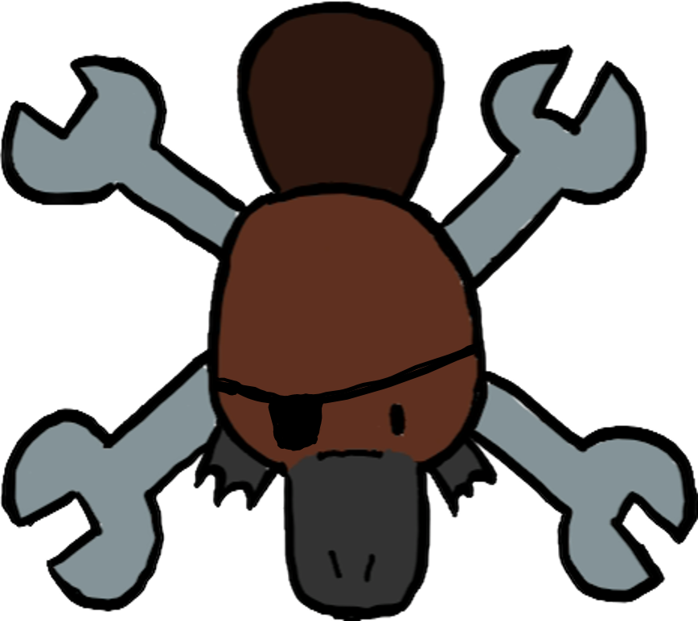

<!-- Improved compatibility of back to top link: See: https://github.com/othneildrew/Best-README-Template/pull/73 -->
<a name="readme-top"></a>
<!--
*** Thanks for checking out the Best-README-Template. If you have a suggestion
*** that would make this better, please fork the repo and create a pull request
*** or simply open an issue with the tag "enhancement".
*** Don't forget to give the project a star!
*** Thanks again! Now go create something AMAZING! :D
-->


<!-- PROJECT SHIELDS -->
<!--
*** I'm using markdown "reference style" links for readability.
*** Reference links are enclosed in brackets [ ] instead of parentheses ( ).
*** See the bottom of this document for the declaration of the reference variables
*** for contributors-url, forks-url, etc. This is an optional, concise syntax you may use.
*** https://www.markdownguide.org/basic-syntax/#reference-style-links

[![Contributors][contributors-shield]][contributors-url]
[![Forks][forks-shield]][forks-url]
[![Stargazers][stars-shield]][stars-url]
[![Issues][issues-shield]][issues-url]
[![MIT License][license-shield]][license-url]
[![LinkedIn][linkedin-shield]][linkedin-url]

-->

<!-- PROJECT LOGO -->
<br />
<div align="center">
  <a href="https://github.com/elleryellery/FIRSTMate">
    
  </a>

  <h3 align="center">FIRST Mate</h3>

  <p align="center">
    A product of the 9181 PlatyPirates.
    <br />
    <a href="https://github.com/elleryellery/FIRSTMate"><strong>Explore our GitHub »</strong></a>
    <br />
    <br />
    <!--
    <a href="https://github.com/othneildrew/Best-README-Template">View Demo</a>
    ·
    <a href="https://github.com/othneildrew/Best-README-Template/issues">Report Bug</a>
    ·
    <a href="https://github.com/othneildrew/Best-README-Template/issues">Request Feature</a>
    --->
  </p>
</div>


<!-- TABLE OF CONTENTS
<details>
  <summary>Table of Contents</summary>
  <ol>
    <li>
      <a href="#about-the-project">About The Project</a>
      <ul>
        <li><a href="#built-with">Built With</a></li>
      </ul>
    </li>
    <li>
      <a href="#getting-started">Getting Started</a>
      <ul>
        <li><a href="#prerequisites">Prerequisites</a></li>
        <li><a href="#installation">Installation</a></li>
      </ul>
    </li>
    <li><a href="#usage">Usage</a></li>
    <li><a href="#roadmap">Roadmap</a></li>
    <li><a href="#contributing">Contributing</a></li>
    <li><a href="#license">License</a></li>
    <li><a href="#contact">Contact</a></li>
    <li><a href="#acknowledgments">Acknowledgments</a></li>
  </ol>
</details>

-->

<!-- ABOUT THE PROJECT -->
## About The Project


FIRST Mate is designed to both entertain and inspire and teaches students of any age the FIRST Robotics design process through a gamified computer program, which takes users through the process of building a pirate ship, FIRST-style!

Here's why:
* We want to facilitate the process of teaching the engineering process to students.
* Our team prioritizes an efficient design process when creating our robot and we want to make the information we use to do so accessible to all.
* It's important for students to learn about design process and documentation for more than just robotics; these skills carry over into any careers in computer science or engineering.  

<p align="right">(<a href="#readme-top">back to top</a>)</p>


### Built with Java in Visual Studio Code.


<!-- GETTING STARTED 
## Getting Started

This is an example of how you may give instructions on setting up your project locally.
To get a local copy up and running follow these simple example steps.

### Prerequisites

This is an example of how to list things you need to use the software and how to install them.
* npm
  ```sh
  npm install npm@latest -g
  ```
-->

### Installation

_Install FIRSTMate as a JAR file for free or play in a browser on our team website!_

<p align="right">(<a href="#readme-top">back to top</a>)</p>


<!-- USAGE EXAMPLES -->
## Usage

This program is designed for use in the classroom and for students interested in learning more about engineering and design. For younger students, we recommend a guided approach to introduce young engineers to the process of design documentation, but students in middle or high school may prefer to explore the game on their own. 

For a full list of tutorials on using the program, please see the instructional videos on our team YouTube channel!

_For more examples, please refer to the [Documentation](https://example.com)_


<!-- ROADMAP 
## Roadmap

- [x] 
- [x] Add back to top links
- [ ] Add Additional Templates w/ Examples
- [ ] Add "components" document to easily copy & paste sections of the readme
- [ ] Multi-language Support
    - [ ] Chinese
    - [ ] Spanish

See the [open issues](https://github.com/elleryellery/FIRSTMate/issues) for a full list of proposed features (and known issues).

<p align="right">(<a href="#readme-top">back to top</a>)</p>

-->

<!-- CONTACT -->
## Contact

Email the PlatyPirates... - team@platypirates.org

...or visit our social media. -[Instagram](https://www.instagram.com/frc_platypirates/) - [Facebook](https://www.facebook.com/profile.php?id=61553134072954&mibextid=LQQJ4d) - [YouTube](https://www.youtube.com/@ThePlatyPirates)

<p align="right">(<a href="#readme-top">back to top</a>)</p>


<!-- ACKNOWLEDGMENTS -->
## Acknowledgments

Resources that we used in the production of FIRSTMate:

* [README Template](https://github.com/othneildrew/Best-README-Template)

<p align="right">(<a href="#readme-top">back to top</a>)</p>


<!-- MARKDOWN LINKS & IMAGES -->
<!-- https://www.markdownguide.org/basic-syntax/#reference-style-links -->
[contributors-shield]: https://img.shields.io/github/contributors/othneildrew/Best-README-Template.svg?style=for-the-badge
